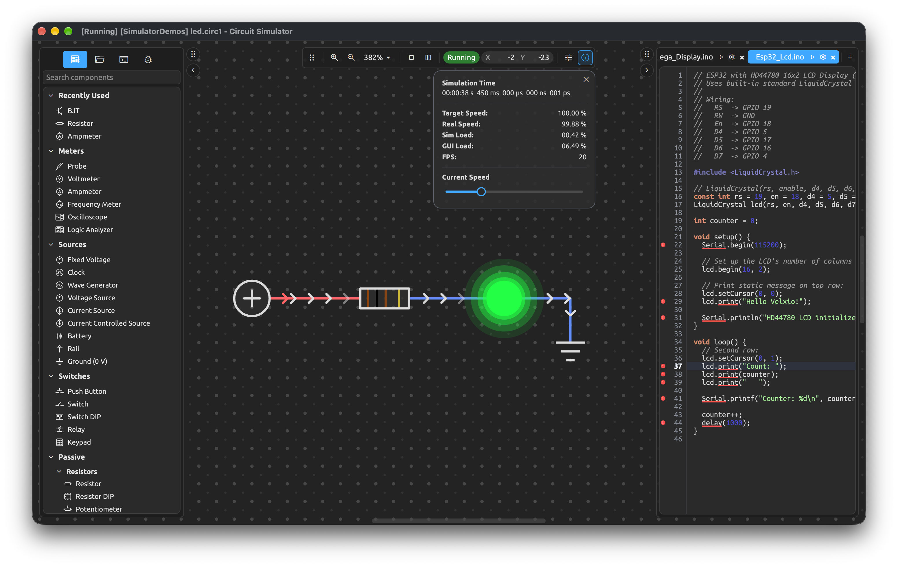

# Circuit Simulator

Circuit Simulator is a real-time electronic circuit schematic capture and simulation suite with integrated microcontroller emulation, code editing, and debugging toolchains. Built in Rust and powered by a fluid Qt Quick / QML frontend, it delivers fast, deterministic mixed-signal simulation and embedded systems co-simulation.



## Features

### Mixed-Signal Simulation Engine
- **Non-Linear Analog Solver**: Real-time Modified Nodal Analysis (MNA) solver for continuous-time DC, AC, and transient analysis.
- **Discrete-Event Digital Engine**: Event-driven logic simulation with sub-nanosecond precision and propagation delay modeling.
- **Rich Component Library**:
  - **Passives & Sources**: Resistors, potentiometers, trimmers, capacitors, electrolytic capacitors, inductors, transformers, batteries, DC/AC voltage and current sources, ground, voltage rails, clock and arbitrary waveform generators.
  - **Semiconductors & Actives**: Diodes, Zener diodes, LEDs, RGB LEDs, BJTs (NPN, PNP), MOSFETs (N/P-channel), JFETs, DIACs, TRIACs, SCRs, op-amps, comparators, and linear voltage regulators.
  - **Digital Logic & ICs**: Full logic gate families (AND, NAND, OR, NOR, XOR, XNOR, NOT, Buffers, Tri-State), Flip-Flops (D, JK, T, RS), latches, binary counters, decoders, multiplexers/demultiplexers, shift registers, adders, 555 timers, ADCs, DACs, SRAM, and EEPROM.
  - **Displays & Outputs**: HD44780 LCD, KS0108 Graphic LCD, PCD8544 (Nokia 5110), SSD1306 and SH1107 OLEDs, PCF8833 TFT, 7-segment displays (direct & BCD), LED matrices, LED bars, WS2812 addressable RGB LEDs, DC motors, stepper motors, RC servos, and audio buzzers.
  - **Sensors & Human Interface**: Pushbuttons, toggle & DIP switches, matrix keypads, analog joysticks (KY-023), rotary encoders (KY-040), light-dependent resistors (LDR), thermistors (NTC/PTC), RTDs, strain gauges, DS18B20 1-Wire sensors, DHT22 temp/humidity, DS1307 RTC, DS1621 I2C thermometers, and HC-SR04 ultrasonic sensors.
- **Modular Subcircuits & IC Packaging**: Encapsulate complex circuits into reusable hierarchical blocks with customizable pinouts and visual IC packages (DIP, SOIC, custom).

### Microcontroller Emulation & Co-Simulation
- **Integrated Pure-Rust MCU Cores (`cs-mcu`)**: Cycle-accurate instruction set simulation for:
  - **AVR / Arduino**: ATmega8, ATmega16, ATmega32, ATmega328, ATtiny85, Arduino Uno, Nano, Mega, Leonardo, etc.
  - **PIC**: PIC12 and PIC14 families (PIC12F675, PIC16F628, PIC16F84, PIC16F877, PIC16F88, etc.).
  - **8051 / 8052**: Standard Intel 8051 instruction set and register models.
  - **MCS-6502**: Classic 6502 / 65C02 microprocessor core.
  - **Zilog Z80**: Complete Z80 CPU emulation.
- **Hardware Peripheral Emulation**: Timers, PWM/Capture/Compare (CCP), UART/USART, SPI, TWI/I2C, external interrupts, and EEPROM/Flash data spaces.
- **Scriptable MCUs (`cs-script`)**: Virtual microcontrollers scripted with AngelScript with host bindings for GPIO, UART, SPI, and I2C.
- **QEMU Co-Simulation (`cs-qemu`)**: External QEMU bridge for full 32-bit hardware co-simulation (ESP32 and STM32) communicating via low-latency shared-memory arenas.

### Virtual Instrumentation & Analysis
- **Multi-Channel Oscilloscope**: Real-time waveform display with trigger modes (auto, normal, single), voltage scaling, and timebase controls.
- **Logic Analyzer**: Multi-channel digital timing and state capture.
- **Measurement Tools**: Voltmeter, Ammeter, Frequency Meter, and interactive Signal Probes.
- **Serial Communication**: Serial Monitor and Serial Terminal supporting both host serial ports and virtual MCU streams.
- **Diagnostics & Inspection**: Live MCU register view, pin status monitors, and memory table viewers.
- **Automated Verification**: Integrated `TestUnit` component and batch test runner for automated regression testing.

### Integrated Code Editor & Debugging
- **Multi-Tab Code Editor**: Syntax highlighting, auto-indentation, find/replace, and code formatting.
- **LSP Support**: Language Server Protocol integration for intelligent code completion and diagnostics.
- **Integrated Toolchains**: Compilation support for AVR-GCC, SDCC (8051/PIC/Z80), GPUTILS, Arduino CLI, and AngelScript.
- **Interactive Debugging**: GDB integration with source-level stepping, breakpoints, register watchers, and symbol tables.

### Modern User Interface & Rendering
- **Hardware-Accelerated UI**: Fluid Qt Quick / QML interface with custom grid shaders.
- **Centralized Theme Engine**: Seamless Light and Dark theme support.
- **Native Platform Features**: macOS Touch Bar, native menu bars, title bar customization, and Windows DWM integration.
- **High-Resolution Export**: Export circuit schematics directly to vector SVG, PNG, JPEG, and BMP.
- **Headless CLI**: Run simulations or batch test suites in headless environments (`-nogui`) for CI/CD pipelines.

---

## Architecture

The project is structured as a Rust workspace with modular crates:

```
CircuitSimulator/
├── crates/
│   ├── cs-app/       # Qt Quick / QML application shell, native windowing, canvas items
│   ├── cs-engine/    # MNA solver, digital event engine, component catalog, canvas rendering, CLI
│   ├── cs-mcu/       # Pure-Rust MCU cores (AVR, PIC, 8051, 6502, Z80) and hardware peripherals
│   ├── cs-qemu/      # QEMU co-simulation bridge and shared-memory arena for ESP32/STM32
│   └── cs-script/    # Embedded AngelScript engine binding
├── qml/              # Qt Quick QML components, views, dialogs, and styling
├── resources/        # Shaders, icons, fonts, translations, MCU definitions, and assets
└── scripts/          # Build and packaging scripts (macOS app bundler, translations)
```

---

## Building

### Prerequisites

- **Rust Toolchain**: Rust 2024 edition (Rust 1.85 or later) — [rustup.rs](https://rustup.rs)
- **Qt 6**: Qt Core, Gui, Quick, Qml development packages along with build tools (`moc`, `rcc`, `qsb`, `qmake`)
- **C++ Compiler**: A C++17 compatible compiler (Clang, GCC, or MSVC)
- **Host Dependencies (Linux)**: `pkg-config`, `libasound2-dev` (ALSA), `libudev-dev`

### Build Instructions

```sh
# Clone the repository
git clone https://github.com/velitasali/CircuitSimulator.git
cd CircuitSimulator

# Build the application in release mode
cargo build -p cs-app --release

# Run the application
cargo run -p cs-app --release
```

### macOS Application Bundle

To build a standalone macOS `.app` bundle:

```sh
./scripts/macos/bundle.sh release
```

The output bundle will be generated at `target/release/Circuit Simulator.app`.

### Running Tests

```sh
cargo test --workspace
```

---

## Command Line Usage

Circuit Simulator can be launched interactively or in headless mode:

```sh
# Launch GUI and open a circuit file
circuitsimulator path/to/circuit.circ1

# Launch GUI without restoring the previous project session
circuitsimulator -noproject

# Run a circuit headlessly until interrupted
circuitsimulator -nogui -runcirc path/to/circuit.circ1

# Run automated batch tests across a directory of circuits
circuitsimulator -nogui -test path/to/circuits/

# Display help and usage information
circuitsimulator --help
```

---

## License

Circuit Simulator is open-source software distributed under the terms of the GNU General Public License v3 (GPL-3.0-or-later). See [`COPYING`](COPYING) for details.
